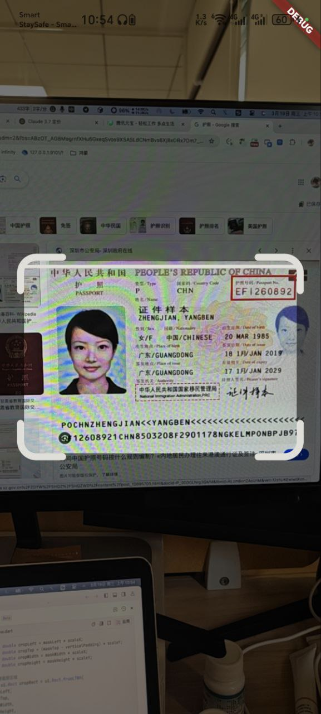
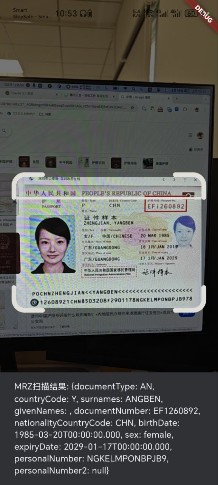
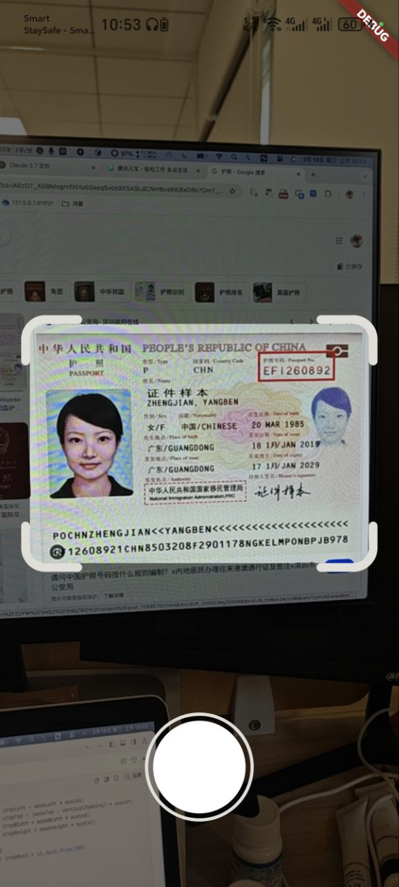

# MRZ Scanner Plus

一个用于扫描和解析旅行证件机读区 (MRZ) 的 Flutter 插件。在扫描或拍摄文档时，它会自动检测 MRZ 区域，并仅返回遮罩内的文档图像。

[](https://pub.dev/packages/mrz_scanner_plus)

[English](README.md) | [中文](README_CN.md) | [日本語](README_JP.md) | [한국어](README_KR.md) | [Deutsch](README_DE.md)

## 特性

- 实时 MRZ 扫描和解析
- 自动文档区域检测
- 支持扫描和拍照模式
- 可自定义 UI 遮罩
- 内置文档裁剪
- 支持多种 MRZ 文档类型

## 截图展示

### 扫描模式

| MRZ 扫描界面 | 扫描结果 | 文档图像 |
|:---:|:---:|:---:|
|  |  |  |

### 拍照模式

| 拍照界面 | 处理结果 |
|:---:|:---:|
|  |  |

## 安装

在 `pubspec.yaml` 文件中添加依赖：

```yaml
dependencies:
  mrz_scanner_plus: ^0.0.1
```

或通过命令行安装：

```bash
flutter pub add mrz_scanner_plus
```

## 使用方法

### 基本实现

```dart
import 'package:mrz_scanner_plus/mrz_scanner_plus.dart';

class CameraScanPage extends StatefulWidget {
  @override
  State<CameraScanPage> createState() => _CameraScanPageState();
}

class _CameraScanPageState extends State<CameraScanPage> {
  void _onMRZDetected(String imagePath, MRZResult mrzResult) {
    print('MRZ 结果: ${mrzResult.toJson()}');
    print('图片路径: $imagePath');
  }

  @override
  Widget build(BuildContext context) {
    return Scaffold(
      body: CameraView(
        mode: CameraMode.scan,
        onMRZDetected: _onMRZDetected,
      ),
    );
  }
}
```

### 拍照模式

```dart
CameraView(
  mode: CameraMode.photo,
  onPhotoTaken: (String imagePath) {
    print('照片保存在: $imagePath');
  },
)
```

### 自定义

```dart
CameraView(
  mode: CameraMode.scan,
  indicatorColor: Colors.blue, // 自定义遮罩颜色
  customOverlay: YourCustomWidget(), // 自定义遮罩组件
  onMRZDetected: _onMRZDetected,
  onDetected: (String text) {
    print('OCR 文本: $text');
  },
)
```

## API 参考

### CameraView

| 属性 | 类型 | 描述 |
|----------|------|-------------|
| `mode` | `CameraMode` | 相机模式（扫描/拍照）|
| `indicatorColor` | `Color?` | 扫描遮罩颜色 |
| `onMRZDetected` | `Function(String, MRZResult)?` | MRZ 检测到时的回调 |
| `onPhotoTaken` | `Function(String)?` | 拍照完成时的回调 |
| `onDetected` | `Function(String)?` | 原始 OCR 文本回调 |
| `customOverlay` | `Widget?` | 自定义遮罩组件 |
| `controller` | `CameraController?` | 自定义相机控制器 |
| `photoButton` | `Widget?` | 自定义拍照按钮组件 |

## 许可证

本项目采用 MIT 许可证 - 查看 [LICENSE](LICENSE) 文件了解详情。

## 贡献

欢迎贡献！请随时提交 Pull Request。